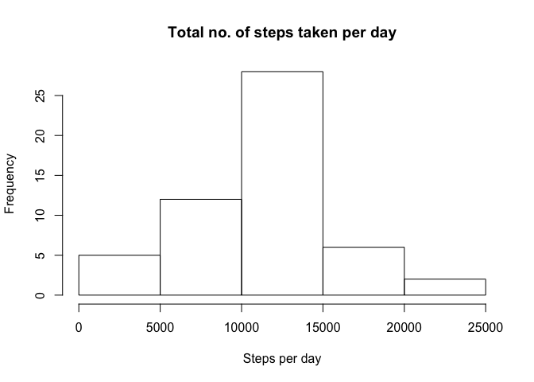
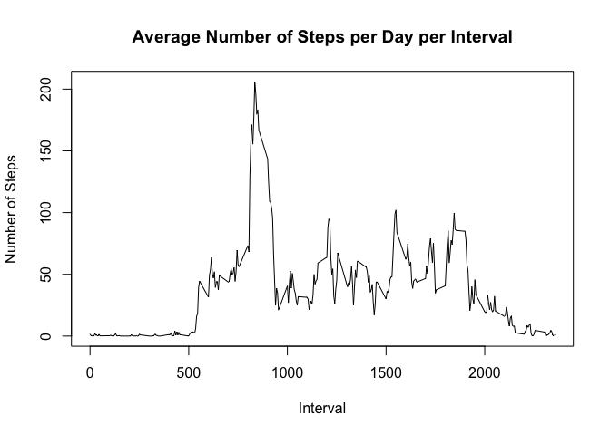
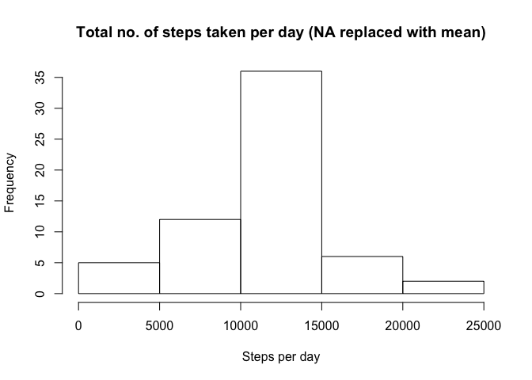
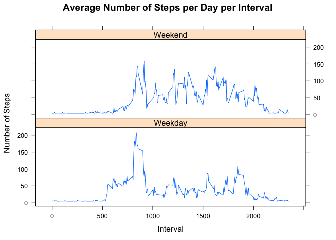

# Reproducible Research: Peer Assessment 1


## Loading and preprocessing the data


```r
datamain<-read.csv("activity.csv")
datamain$date <- as.Date(as.character(datamain$date), "%Y-%m-%d")
data<- datamain[!is.na(datamain$steps), ]
```


## What is mean total number of steps taken per day?


```r
#aggregate no. of steps per day
totalsteps <-aggregate(steps ~ date, data, sum)

#find the mean and median
mean1 <- mean(totalsteps$steps)
median1 <- median(totalsteps$steps)

#plot the histogram
hist(totalsteps$steps, main = "Total no. of steps taken per day", xlab = "Steps per day")
```

 

The mean is ``1.0766189\times 10^{4}``
The median is ``10765``


## What is the average daily activity pattern?


```r
#average steps 
avg_steps <- aggregate(steps ~ interval, data, mean)

#plot the graph
plot(avg_steps$interval,avg_steps$steps, type="l", xlab="Interval", ylab="Number of Steps",main="Average Number of Steps per Day per Interval")
```

 

```r
#max interval
interval_max <- avg_steps[which.max(avg_steps$steps),1]
```

The 5-minute interval ``835`` has the highest number of steps


## Imputing missing values


```r
#count number of NA values
nacount<- sum(is.na(datamain$steps))
```

the number of NA values is ``2304``

All NA values will be replaced with the mean instead to create a new dataset.

```r
#replace the NA values with the mean
newdata = transform(datamain, steps = ifelse(is.na(steps), mean(steps, na.rm=TRUE), steps))

#aggregate no. of steps per day
totalsteps1 <-aggregate(steps ~ date, newdata, sum)

#plot the histogram
hist(totalsteps1$steps, main = "Total no. of steps taken per day (NA replaced with mean)", xlab = "Steps per day")
```

 

```r
#find the new mean and median
mean2 <- mean(totalsteps1$steps)
median2 <- median(totalsteps1$steps)
```

The new mean is ``1.0766189\times 10^{4}``
The new median is ``1.0766189\times 10^{4}``

There is not much difference comparing the previous and new mean and median. 

## Are there differences in activity patterns between weekdays and weekends?


```r
weekdays <- c("Monday", "Tuesday", "Wednesday", "Thursday", 
              "Friday")
newdata$day = as.factor(ifelse(is.element(weekdays(as.Date(newdata$date)),weekdays), "Weekday", "Weekend"))

newsteps <- aggregate(steps ~ interval + day, newdata, mean)

library(lattice)

xyplot(newsteps$steps ~ newsteps$interval|newsteps$day, main="Average Number of Steps per Day per Interval",xlab="Interval", ylab="Number of Steps",layout=c(1,2), type="l")
```

 

